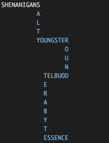

From [Turing](http://today.turing.io/outlines/2015-07-13/).

A word snake is (unsurprisingly) a snake made up of a sequence of words.

For instance, take this sequence of words:

SHENANIGANS SALTY YOUNGSTER ROUND DOUBLET TERABYTE ESSENCE

Notice that the last letter in each word is the same as the first letter in the next word. In order to make this into a word snake, you simply snake it across the screen

Your task today is to take an input word sequence and turn it into a word snake. Here are the rules for the snake:

- It has to start in the top left corner
- Each word has to turn 90 degrees left or right to the previous word
- The snake can't intersect itself

Other than that, you're free to decide how the snake should "snake around". If you want to make it easy for yourself and simply have it alternate between going right and going down, that's perfectly fine. If you want to make more elaborate shapes, that's fine too.
